# rFactor  --> ATI 
Who says automotive, engineering software is boring?

## Background

Trade show excitement!
* why
* how
* result
* benefit to business

## Components

* rFactor
  * highly realistic car racing simulation software
  * C API to receive telemetry data eg engine, car, lap
* rFactor plugin
  * managed C++ plugin
  * republish telemetry data over UDP
* CANLab
  * CAN bus analysis software
  * C# scripting engine
  * receive telemetry data over UDP
  * republish data over CAN bus
  * control instrument cluster
* VISION
  * realtime ECU (engine control unit) analysis software
  * receive realtime data over CAN bus
  * realtime data visualisation
* Ford Focus instrument cluster
  * CAN connected device
* CAN dbc file
  * contains CAN device addresses and data protocol for:
    * speedometer
    * tachometer
    * water temperature
    * high beam
    * turn indicators (!)

## Photos

  
Setup

  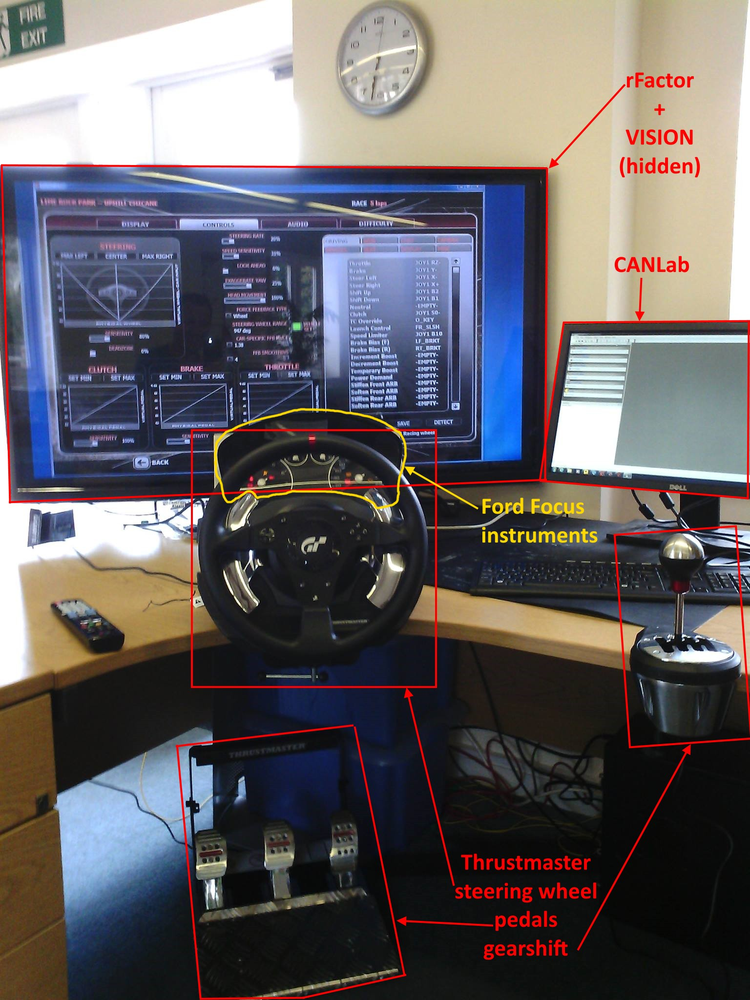

  
Instrument Cluster

  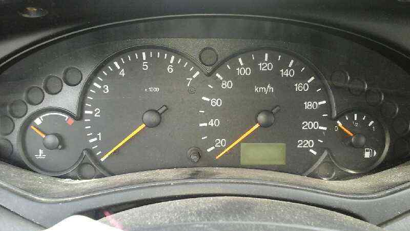

## Architecture

  
Overview

  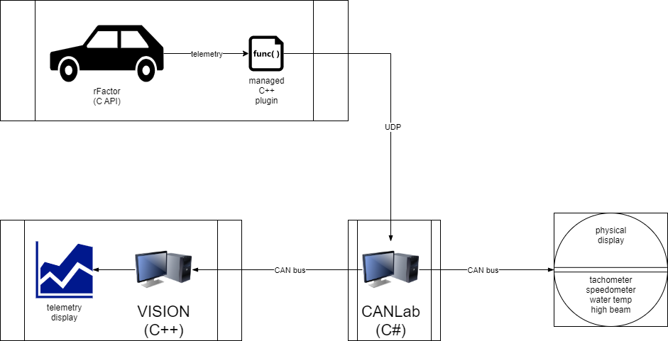

## Screenshots

  
rFactor

  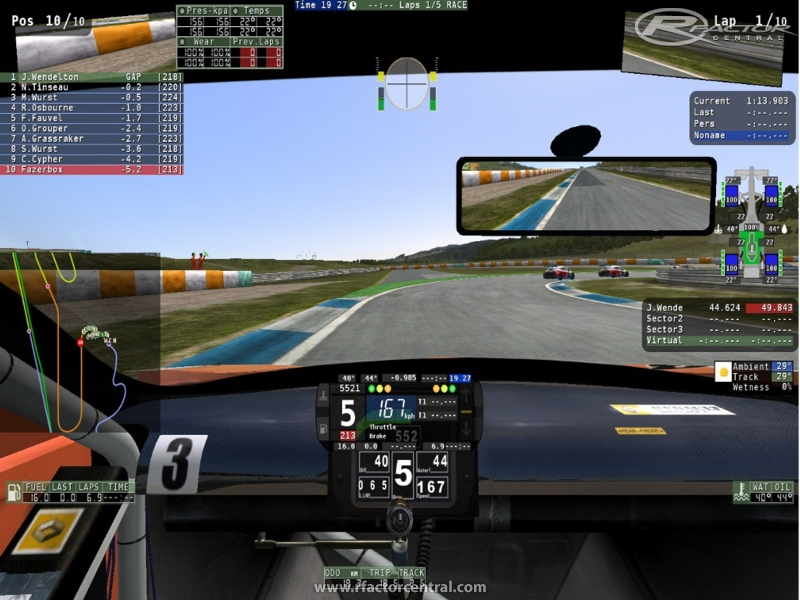
  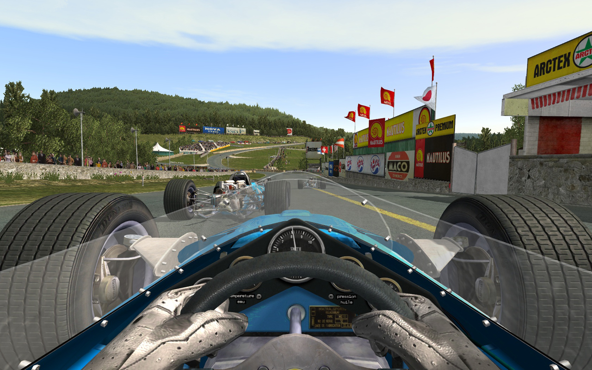
  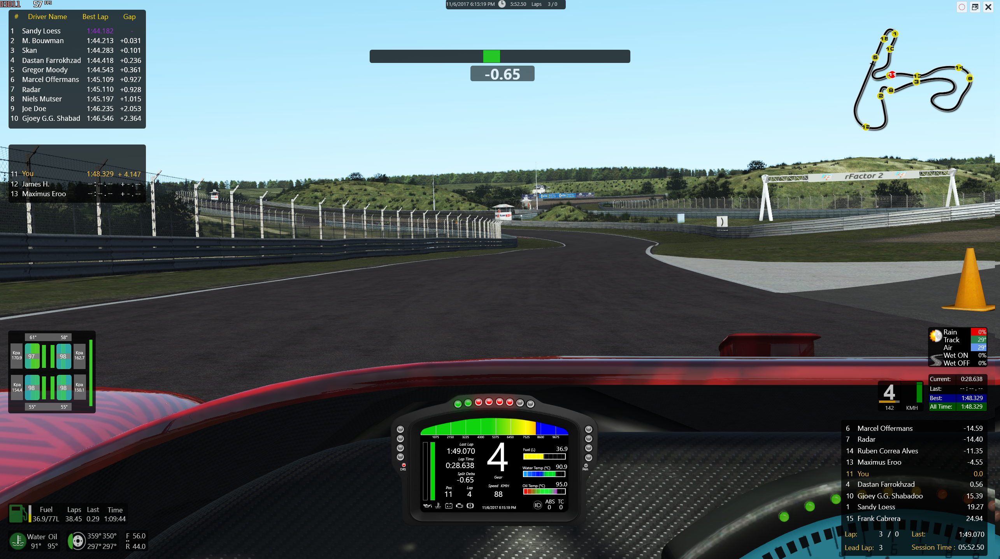
  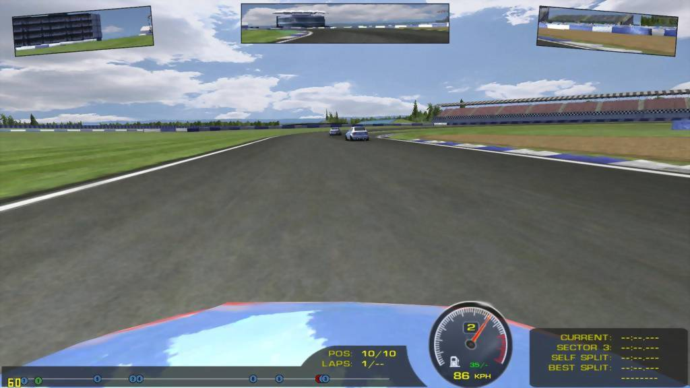

  
VISION

  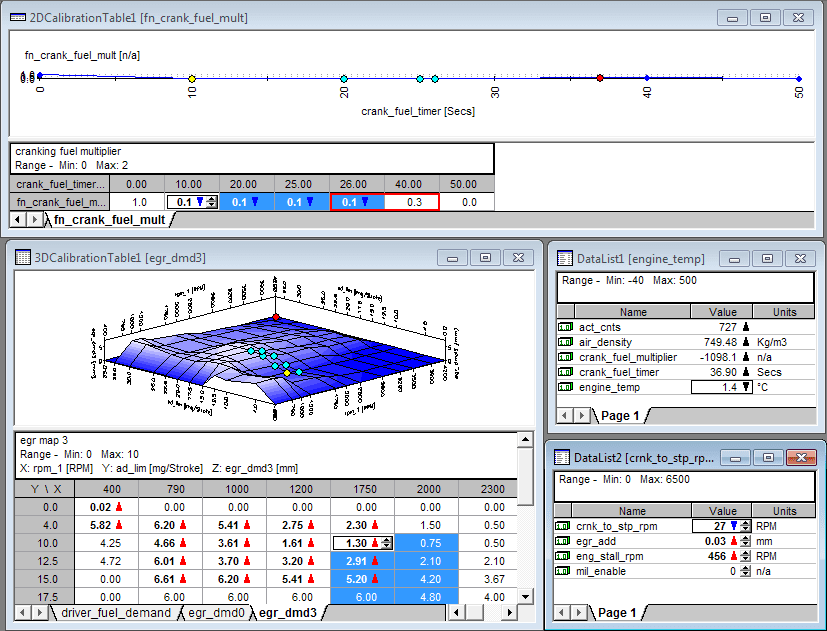
  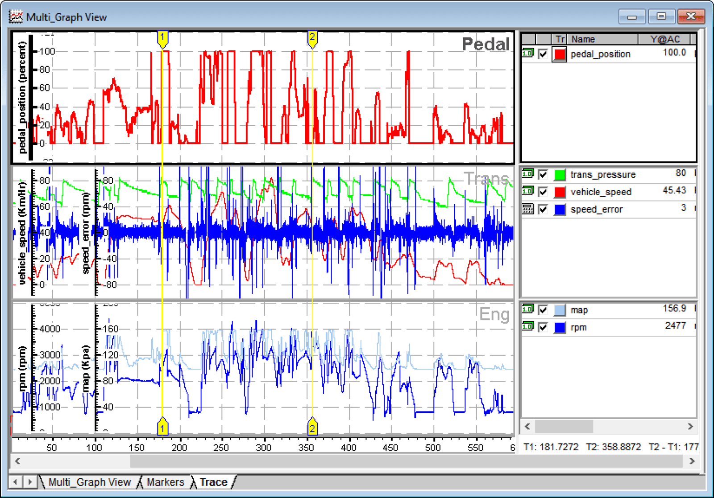
  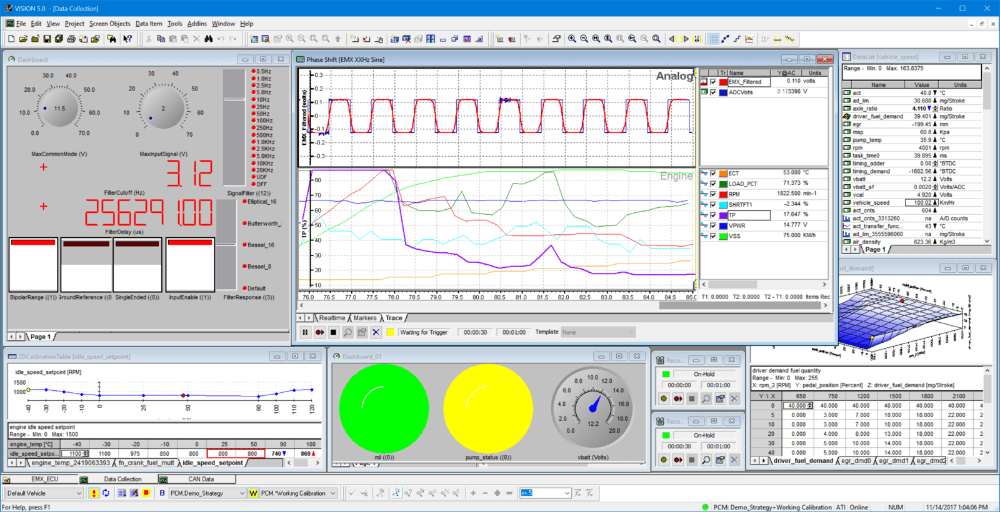

  
CANLab

  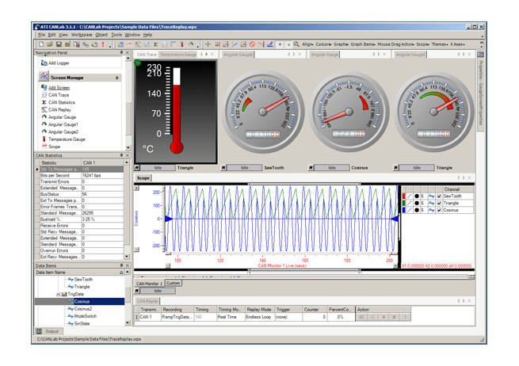
  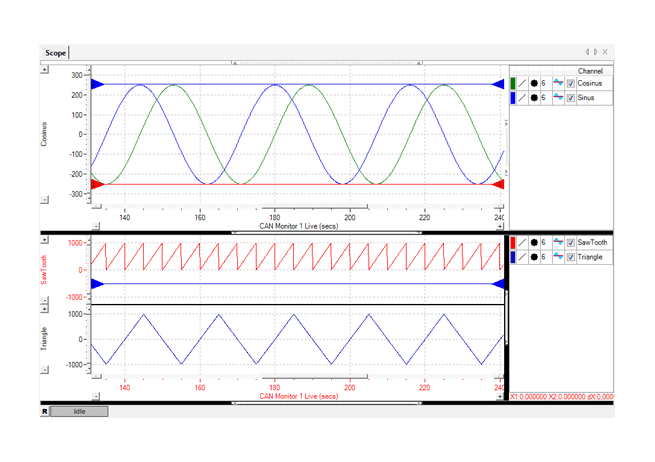
  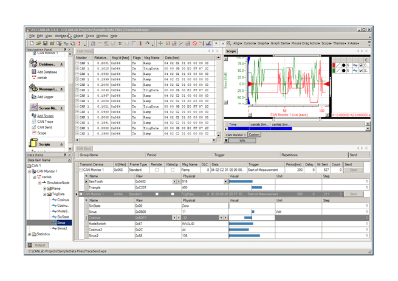
  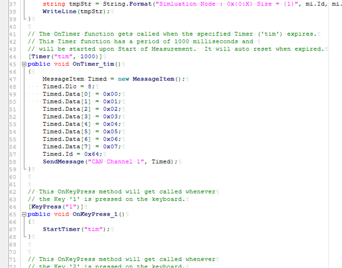

## Further work

* installer for:
  * rFactor plugin
  * CANLab scripts
  * VISION file
* CAN bus setup
* rFactor instructions
  * enabling _hero_ mode

